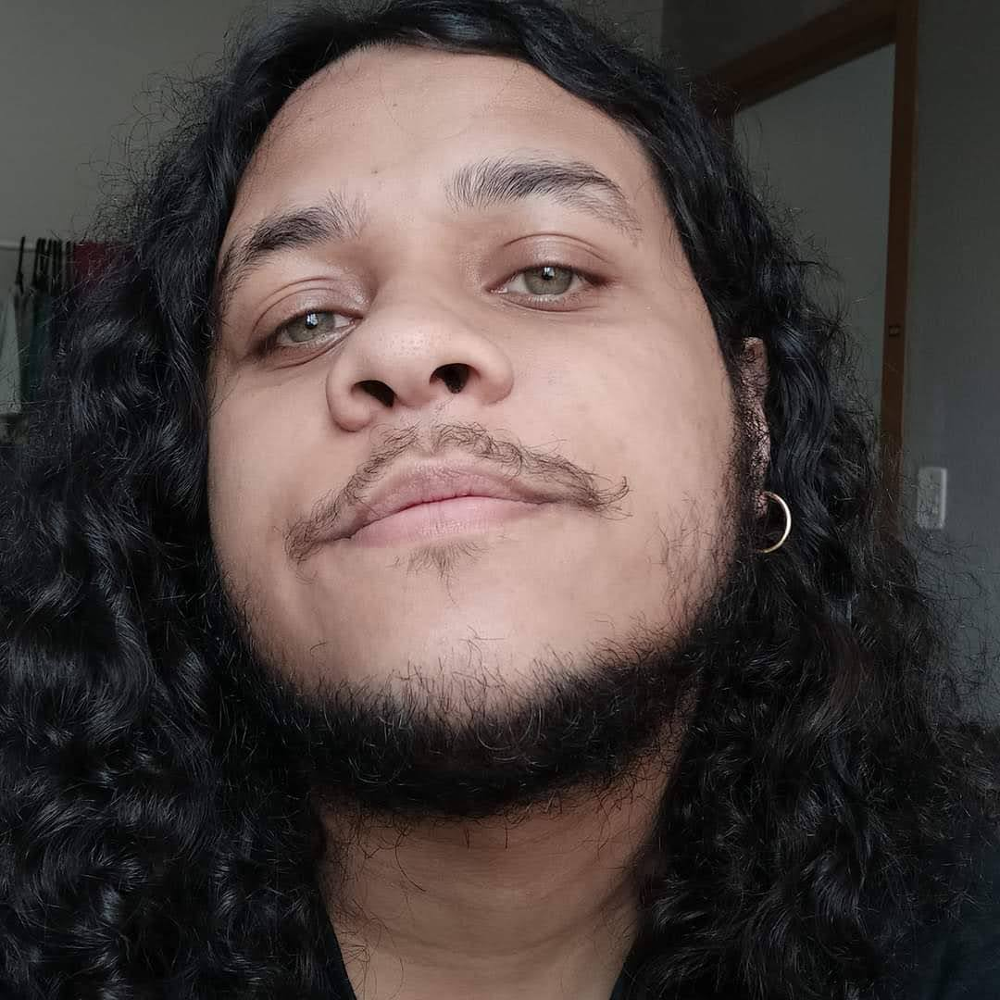

## About

Welcome, I'm Henrique! I'm a 20 year old undergraduate of the Linguistics & Literature program at the Federal University of Rio Grande do Sul (UFRGS), in Brazil.

I'm mostly interested in the literary theory and comparative literature fields, especially in studies of Gothic literature and horror.

---
## Experience
Sep. 2018 - Oct. 2019

**College of Application - UFRGS**

English teacher in third and seventh grade of elementary school, under the supervision of the Institutional Scholarship Program Initiation to Teaching (PIBID)

---
## University extention
**Gender neutrality both in Portuguese and English (2019)**

College of Application Language Week - UFRGS

---

## Contact

You can reach me at [henrique.nunes@ufrgs.br](mailto:henrique.nunes@ufrgs.br)
